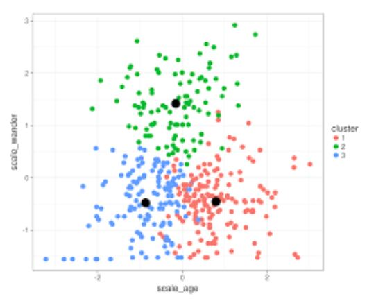

# Applications of Machine Learning in Genomics
### BENG 183 Fall 2018 Sheng Zhong
<b>Rayan Massoud</b>  

I. [Introduction](#1)   
II. [Supervised vs. Unsupervised Learning](#2)  
III. [Model Selection and Optimization](#3)   
IV. [Supervised Learning Applications](#4)  
V. [Unsupervised Learning Applications](#5)  
VI. [Sources](#6)  

## I. Introduction<a name="1"></a>

Machine learning blends together computer science and mathematics involving algorithm and method development to create predictive models. In the post-genomic era, large genomic datasets tended to be extremely complex, and have high dimensionality and noise. This made interpreting genomic data a formidable task, so thankfully machine learning has allowed bioinformaticians to utilize statistical techniques to better comprehend the data. This is the reason why annotation of genomic sequence elements based on DNA pattern recognition was popular in the early days of genomic machine learning. Also, machine learning approaches have since extended to other types of data, such as RNA-Seq differential gene expression, ChIP-Seq and chromatin annotation. Machine learning can also help elucidate underlying biological mechanisms, such as through regulatory networks or pathway inference.

## II. Supervised Learning vs. Unsupervised Learning <a name="2"></a>

Machine learning is often separated into two types of tasks - supervised and unsupervised learning. In this section, we will explore the differences between these two topics and describe the type of data required to use either method. 

#### a. Supervised Learning
Supervised learning involves training a model with already labelled data in order to make predictions about unlabelled examples [1]. As the model learns more about the general properties of the data and identifies the most relevant features, it uses those learned properties to infer new information about the unlabelled data. 

The three components of supervised learning are the following:

- Training input: a collection of data points, each with an associated label
- Post-training input: a collection of data points
- Post-training output: predicted label for the unlabelled data points

#### b. Unsupervised Learning
Unsupervised learning, on the other hand, is trying to find structure in a data set without any labels [1]. It is important to note that for unsupervised learning, there is no training input, so structure often involves clustering and dimensionality reduction. This insures that interpretation of complex genomic datasets becomes less challenging.

- Input: a collection of data points
- Output: predicted label for the unlabelled data points

## III. Model Selection and Optimization  <a name="3"></a>  
  

Model selection and optimization involves splitting the data into training, validation, and testing sets to ensure that the model is both specific and predictive, but generalizable as well.  

The model is initially fit on a <b>training</b> dataset, which is a set of examples used to optimize the model's parameters. Then, the fitted model is tested on the <b>validation</b> dataset, which offers an unbiased evaluation of the model and finetunes the hyperparameters to make sure there is no overfitting. This is used to report how well we expect the model to perform on unseen data. Finally, the <b>test</b> dataset is used to provide an unbiased evaluation of a final model fit on the training dataset. Also, it is used to tune any model parameters that are not directly optimized.

## IV. Supervised Learning Applications<a name="4"></a> 
DNA pattern recognition and text-mining are some examples of supervised learning in genetics and genomics. In this section, we will discuss two prominent examples of supervised learning, Hidden Markov Models and Linear Regression, and demonstrate some applications and their influence on the field.

#### a. Hidden Markov Models  
One of the most prevalent examples of supervised learning is the Hidden Markov Model(HMM). HMMs are a type of Bayesian network that use transition and emission probabilities to interpret the state probability of a dataset. HMMs have been used in bioinformatic modeling from chromatin state discovery [2] to gene finding [1]. Below is a simplified gene finding model, which captures the basic properties of a protein-coding gene.  
  

The model takes as input the DNA sequence of a chromosome or a portion thereof[1]. Start and end coordinates of a gene, splice sites, and UTR are all potential labels for a model like this. The model uses this training data to learn general properties of genes, including the DNA pattern near donor and acceptor splice sites, the expected length distributions for each element, and patterns within elements, such as typical codons in an exon vs. an intron. The trained model is then able to use these learned properties to identify novel genes that resemble the genes in the training set.  

Unfortunately, this type of model has certain limitations. It is incapable of identifying overlapping genes or multiple isoforms of the same gene. Similar limitations exist for other applications of HMMs, such as in topologically associating domains (TAD) discovery and directionality index creation in Hi-C data, wherein a simple HMM as above cannot find a hierarchy of TADs. More complex models are usually useful for biological tasks like these.

#### b. Linear Regression  
Linear regression is another example of supervised learning in genomics. It can be used in population genomics and medical genetics to perform single SNP association testing by optimizing the sum of the squared differences in a dataset. Notice how this dataset can be modeled in three ways - additive, dominant, and recessive. Each model attempts to estimate the proportion of phenotypic variation, in this case, cholesterol, explained by the SNP, and uses the coefficient of determination, or R^2 value, to assign confidence to that estimation [3]. 
  
One approach to choosing a statistical model is selecting simplest model that contains the right parameters and assumptions based on our biological data. After this, we can use the simple model to work toward building rigor and complexity. Thus, it is important to understand what the assumptions of each model are, and how it relates to the problem we are trying to solve. In the additive model, for example, by putting a line to the dataset, we are exploring the phenomenon that the number of minor alleles, or major alleles, is correlated with phenotypic variation. As such, the two homozogytes are equally different to the heterozygote. Such distinctions are important when performing association studies, e.g. for purposes related to drug target discovery.  

## V. Unsupervised Learning Applications<a name="5"></a>  
Finally, bioinformaticians also often work with unlabelled data and use various clustering and dimensionality reduction algorithms to make sense of it. Here, we will discuss two such algorithms, Hierarchical Clustering and K-means Clustering, and their uses in the field.  

#### a. Hierarchical Clustering  
  
Hierarchical clustering is useful for clustering datapoints to determine a similarity relationship within clusters and between clusters. The algorithm for hieararchical clustering is as follows:  
```
1. First, what determines what makes some points more “similar” to each other than other points. For example, we could use distance between points as a basis for similarity  
2. The similarity between all pairs of points is calculated
3. Each profile is placed in its own cluster
4. The two most similar cluster are paired together into a new cluster (While doing this we create a dendrogram, where these two points are connected by a branch)
5. Similarity is calculated using a specified, user-defined clustering method (Examples are UPGMA, Complete Linkage and Single Linkage)
6. Repeat steps the above two steps until everything is in one cluster
```
The following is to further expand on the types of user-defined clustering methods:
```
Unweighted Pair Group Method with Arithmetic Mean (UPGMA): The average distance is calculated from each point in a cluster to all other points in another cluster. The two clusters with the lowest average distance are joined together to form a new cluster.
Complete Linkage: The dissimilarity between two groups is equal to the greatest dissimilarity between a member of one cluster and a member of another cluster. This method tends to produce very tight clusters.
Single Linkage: The dissimilarity between two clusters is the minimum dissimilarity between members of the two clusters. This method produces clusters in long chains and can readily identify outliers.
```
An important real world application of hierarchical clustering is in evolutionary genomics, where this method could produce a phylogenetic tree based on how similar species (data points) are to each other.

#### b. K-means Clustering  
  
K-means clustering offers an alternative method of aggregating datapoints for further analysis. The algorithm for k-means clustering is as follows:  
```
1. Begin with predetermined choice of clusters K, which are represented by centroids. Iterate the following two steps.
2. For each data point, find the closest mean vector and assign the object to the corresponding cluster
3. For each cluster, update its mean vector based on all the points that have been assigned to it
4. Terminate after predetermined number of iterations OR after a certain percentage of data points converge inside a cluster. (Alternatively, when nothing changes, meaning no points are assigned to different clusters compared to the previous iteration, we stop.)
```  
A real world application of k-means clustering is to cluster gene expression profiles to predict gene function or cluster patient samples to predict clinical characteristics [4]. Altogether, both clustering methods are valid ways to model biological occurences and provide key information about how data points, that represent genetic information, are related to each other. One key difference between the two methods is that hierarchical clustering is determinate, meaning the clustering solution will always be the same, whereas k-means depends on random initialization, meaning the clustering solution can vary each time. Another difference is that hierarchical clustering allows the scientist to understand the hierarchy of the dataset, perhaps by creating a dendrogram, whereas k-means rigidly assigns clusters without offering an understanding of their relationship within and to each other.  

Overall, machine learning is continuously growing in general and within the broad field of bioinformatics. With that being said, it is vital to evaluate the concerns and ongoing challenges in bioinformatics-related applications as they approach clinical and widespread usage. Nonetheless, such methods offer a powerful basis from which to provide insight toward discovery in genomics.  

# Sources outside of class<a name="6"></a>  
[1] Libbrecht M.W., Noble W. S. Machine Learning Applications in Genetics and Genomics. Nature Reviews Genetics. 16, (2015) 321-332.  
[2] Ernst, Jason and Manolis Kellis. “ChromHMM: automating chromatin-state discovery and characterization” Nature methods vol. 9,3 215-6. 28 Feb. 2012, doi:10.1038/nmeth.1906  
[3] Thornton, Timothy and Michael Wu. "Genetic Association Testing with Quantitative Traits". Summer Institute in Statistical Genetics 2015 Lecture 2.  
[4] Hong, Pengyu. "Clustering Algorithms, Bioinformatics Data Analysis and Tools". http://www.ibi.vu.nl/teaching/masters/bi_tools/2008/tools_lec4_2008_handout.pdf
